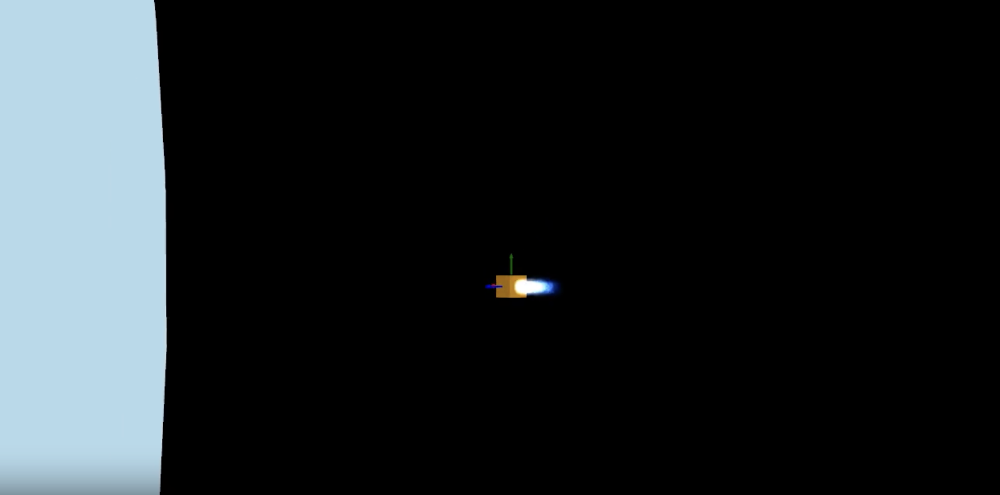

# GNC Sandbox
A low-fidelity orbit simulation for testing GNC and orbital dynamics concepts.

To start, edit `main.py` to import the `scene` object from the desired Scenario to run. Then run using `uv run main.py`.

## Scenario dynamics

`scene.step(X)` integrates one simulation timestep. Scenarios define two kinds
of loads:

```python
def forces(self, X):
    # Reevaluate using each integration-stage state.
    return (forces.gravity(X, Earth, self.spacecraft)
            + forces.gravity(X, Moon, self.spacecraft))

def held_forces(self):
    # Sample once per simulation step. The base implementation returns
    # self.control_force, or an empty Force for uncontrolled scenarios.
    return self.control_force
```

Keep guidance updates and random draws out of `forces(X)`. For sampled
disturbances, override `held_forces()` as in `LAUNCH_karman`. The guidance
schedule still determines how often commands change; integration stages do
not rerun the controller. Thrust and control torque are held in the inertial
frame for the commanded interval. Their acceleration response is calculated
at each RK stage from spacecraft mass and the current attitude/inertia.

`Force` stores `fx`, `fy`, `fz` in newtons and `tx`, `ty`, `tz` in newton-metres,
all in inertial axes; torque is about the spacecraft's center of mass. For
example, `Force(fx=100, tz=2)` applies 100 N and 2 N m. The `force_I` and
`torque_I` properties return vector copies, and
`Force.from_vectors(force_I=F, torque_I=T)` constructs a load from vectors.

Translational dynamics use `a = F / mass`. Rotational dynamics always include
Euler's equation, `I_body * alpha_body = torque_body - omega_body × (I_body * omega_body)`.
Torque-free rotation is intrinsic rigid-body motion, so scenarios no longer
add a `torque_free_rotation` force. Body inertia is specified in kg m².

The integrator uses fixed-step RK4, with four environment evaluations per
ordinary airborne step. `scene.max_integration_step` defaults to 1 second;
larger simulation timesteps are subdivided, and smaller ones use one RK4
step. This avoids constructing an adaptive solver on every control update.
There is no adaptive error estimator: choose a smaller integration step for
fast rotation or rapidly varying loads. Reducing the integration step does
not change the control hold period.

Add `forces.normal_force(X, body, self.spacecraft)` to register that body's
spherical contact surface. The integrator resolves an incoming surface
crossing within a step, checks the existing 10 m/s crash threshold at impact,
and stops a slower impact on the surface. Support cancels only net inward
acceleration, so thrust must exceed gravity to lift off. Contact retains the
simple inelastic stop model; it does not model landing gear or rebound.

Direct users of `State` can use the same split:

```python
X.update(dt, spacecraft, held_control,
         state_forces=environment_callback, max_step=0.1)
```

Passing only a `Force` still gives a zero-order-held external load. The second
argument is now the spacecraft, supplying both mass and body inertia; the old
acceleration fields (`xddot`, `w1dot`, etc.) have been removed. Controllers
return torques in N m, and impulse accounting converts thrust to delta-v with
`F * dt / mass`. Disturbance covariance is ordered `[Fx, Fy, Fz, Tx, Ty, Tz]`
in physical force/torque units. `LAUNCH_karman` converts its former acceleration
noise tuning at the launch attitude to an inertial force/torque covariance.

Run accuracy, scenario, and landing regressions with:

```sh
.venv/bin/python -m unittest discover -s tests -v
```


